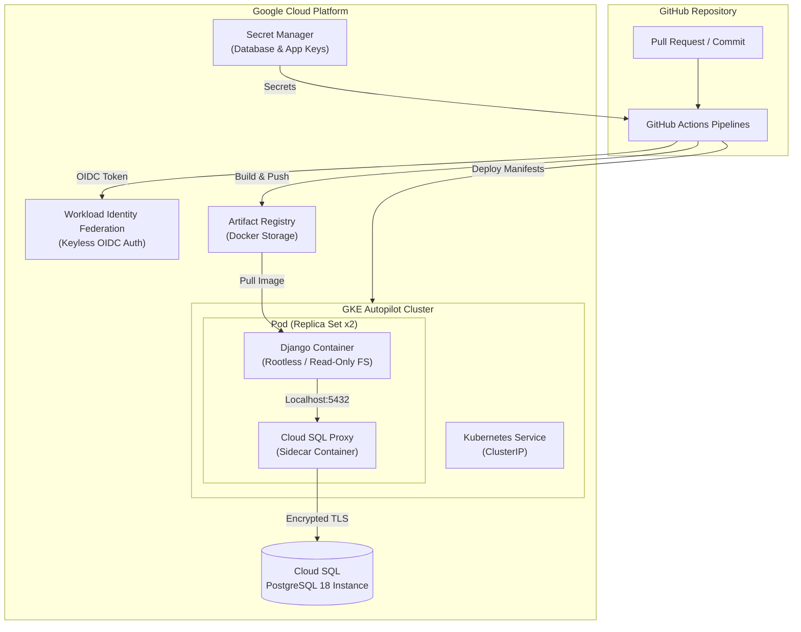

# Platform Engineering Practice: Todo Backend

A hands-on, production-grade sandbox project designed to master the fundamentals of **Platform Engineering**, **DevSecOps**, **Cloud Infrastructure**, and **Kubernetes Orchestration**.

This project implements an end-to-end cloud platform architecture deploying a Python/Django REST API backend to **Google Kubernetes Engine (GKE Autopilot)** with a managed **Google Cloud SQL (PostgreSQL)** database, managed entirely via **Terraform** and **GitHub Actions**.

---

## 🏗️ Architecture Overview



---

## 🎯 Purpose of the Project

The primary goal of this repository is to practice building a **modern internal platform developer experience (DevEx)** and **robust cloud infrastructure**, following modern site reliability and platform engineering principles:

1. **Infrastructure as Code (IaC)**: Provision and manage cloud resources declaratively using Terraform without manual cloud console interactions.
2. **Keyless Authentication & Security Hardening**: Eliminate long-lived credentials by adopting OIDC Workload Identity Federation (WIF) and enforcing non-root, read-only root filesystems for container runtimes.
3. **Automated DevSecOps Pipelines**: Shift security left by enforcing automated static analysis (SAST), secret scanning, linting, IaC security scanning, and container vulnerability scanning on every PR.
4. **Cloud-Native Kubernetes Delivery**: Implement reliable container orchestration on GKE Autopilot featuring the sidecar pattern, resource boundary limits, and zero-downtime rolling updates.

---

## 🚀 What Has Been Done

### 1. Application Containerization & Hardening
- Built a multi-stage, production-ready [`Dockerfile`](file:///e:/dev/practice/todo/server/Dockerfile) based on `python:3.14-slim`.
- Configured **Rootless Container Execution** using an unprivileged user (`appuser` UID 10001).
- Implemented **Gunicorn** as a production WSGI HTTP server listening on port `8080`.
- Applied dependency layer caching and security updates for dependencies (`setuptools`, `msgpack`, `gunicorn`).

### 2. Infrastructure as Code ([`terraform/`](file:///e:/dev/practice/todo/server/terraform/))
- **Remote State**: Centralized GCS state storage backend (`gcs`) with state locking.
- **Managed Kubernetes**: Provisioned GKE Autopilot cluster ([`gke.tf`](file:///e:/dev/practice/todo/server/terraform/gke.tf)) with cluster auto-scaling and managed node upgrades.
- **Database Provisioning**: Created GCP Cloud SQL PostgreSQL 18 instance ([`cloud_sql.tf`](file:///e:/dev/practice/todo/server/terraform/cloud_sql.tf)) with SSL/TLS encryption mandated (`ENCRYPTED_ONLY`).
- **Container Storage**: Provisioned GCP Artifact Registry Docker repository ([`artifact_registry.tf`](file:///e:/dev/practice/todo/server/terraform/artifact_registry.tf)).
- **Secret Management**: Stored dynamically generated database passwords and Django secret keys in GCP Secret Manager ([`secrets.tf`](file:///e:/dev/practice/todo/server/terraform/secrets.tf)).
- **Identity & Access Management (IAM)**: Established Workload Identity Federation (WIF) ([`wif.tf`](file:///e:/dev/practice/todo/server/terraform/wif.tf)) mapping GitHub repository assertions directly to GCP Service Accounts without JSON key files.

### 3. Kubernetes Manifests ([`k8s/`](file:///e:/dev/practice/todo/server/k8s/))
- **Sidecar Pattern Deployment** ([`deployment.yaml`](file:///e:/dev/practice/todo/server/k8s/deployment.yaml)):
  - **App Container**: Runs the Django API with strict CPU/memory requests (`100m`/`128Mi`) and limits (`250m`/`256Mi`).
  - **Cloud SQL Proxy Sidecar**: Runs `gcr.io/cloud-sql-connectors/cloud-sql-proxy:2.14.1` to securely proxy database connections over `127.0.0.1:5432`.
  - **Security Contexts**: Configured `runAsNonRoot: true`, `readOnlyRootFilesystem: true`, dropped all Linux capabilities (`capabilities.drop: ALL`), and provided temporary scratch space via `emptyDir` mounted at `/tmp`.
- **Internal Networking** ([`service.yaml`](file:///e:/dev/practice/todo/server/k8s/service.yaml)): Configured a `ClusterIP` Service exposing port 80 mapped to target port 8080.

### 4. CI/CD & DevSecOps Pipelines ([`.github/workflows/`](file:///e:/dev/practice/todo/server/.github/workflows/))
- **PR Quality & Security Guardrails** ([`pr-check.yml`](file:///e:/dev/practice/todo/server/.github/workflows/pr-check.yml)):
  - **GitLeaks**: Scans the git commit history to block hardcoded secret leaks.
  - **Ruff & Django Tests**: Fast Python linting and unit test execution.
  - **CodeQL**: Static Application Security Testing (SAST) for Python code vulnerabilities.
  - **Terraform Quality & Security**: Runs `terraform fmt -check`, `terraform validate`, and scans IaC for security misconfigurations using **Trivy**.
- **Automated Infrastructure Deployment** ([`deploy-infra.yml`](file:///e:/dev/practice/todo/server/.github/workflows/deploy-infra.yml)): Automatically executes `terraform apply` when changes are pushed to `terraform/**`.
- **Continuous Deployment Pipeline** ([`deploy-app.yml`](file:///e:/dev/practice/todo/server/.github/workflows/deploy-app.yml)):
  - Authenticates via dynamic WIF OIDC tokens.
  - Builds and tags Docker container images with Git commit SHA and `latest`.
  - Performs container vulnerability scanning with Trivy (`CRITICAL`, `HIGH`).
  - Pushes scanned images to GCP Artifact Registry.
  - Dynamically injects Cloud SQL connection names and secrets into K8s manifests.
  - Deploys workloads to GKE, waits for zero-downtime rolling updates (`kubectl rollout status`), and executes database migrations (`python manage.py migrate`).

---

## 💡 Key Learnings & Technical Understandings

### 🛠️ 1. Terraform (Infrastructure as Code)
* **Centralized Remote State**: Using Google Cloud Storage (GCS) as a backend ensures a single source of truth for infrastructure state, preventing race conditions and facilitating team collaboration.
* **Secret Generation & Injection**: Using `random_password` combined with GCP Secret Manager allows sensitive credentials to be generated programmatically during infrastructure provisioning rather than committed into source control or passed manually.
* **Workload Identity Federation (WIF)**: Service account JSON keys present a major security risk if leaked. WIF replaces key files with short-lived OpenID Connect (OIDC) tokens issued directly by GitHub's token authority (`https://token.actions.githubusercontent.com`), restricted to the specific GitHub repository via attribute conditions (`assertion.repository_owner`).
* **Declarative GCP Service Enablement**: Using `google_project_service` resources ensures all required GCP APIs (Artifact Registry, Secret Manager, GKE, Cloud SQL, IAM) are enabled automatically before dependent resources are built.

### ☸️ 2. Kubernetes (Container Orchestration & Security)
* **The Sidecar Pattern**: In a microservice cloud deployment, connecting directly to a database over public IP or managing SSL certs inside the app container adds bloat and risk. Running Cloud SQL Proxy as a sidecar container in the same Pod allows the application to connect to PostgreSQL over encrypted TLS on `localhost:5432` securely and transparently.
* **Pod & Container Hardening**:
  * `runAsNonRoot` & `runAsUser`: Ensures processes within the container cannot escalate privileges to root on the host node.
  * `readOnlyRootFilesystem`: Mitigates malware or attacker persistence by preventing unauthorized writes to the container filesystem. Explicit `emptyDir` volumes are provided for temporary runtime needs (`/tmp`).
  * `capabilities.drop: ["ALL"]`: Removes default Linux kernel capabilities from the process, adhering strictly to the principle of least privilege.
* **Resource Bounds & GKE Autopilot**: Setting explicit CPU and memory `requests` and `limits` allows Kubernetes schedulers to place workloads efficiently and guarantees predictable performance without node resource starvation.

### 🔄 3. GitHub Actions & DevSecOps Workflows
* **Path-Based Workflow Triggers**: Separating infrastructure pipelines (`paths: ['terraform/**']`) from application code pipelines (`paths: ['server/**', 'Dockerfile', 'k8s/**']`) prevents redundant Terraform runs on application commits and vice-versa.
* **Shift-Left Security Scanning**: Integrating security tools early in the CI/CD feedback loop catches vulnerabilities before deployment:
  * **GitLeaks** prevents credential leaks in source code.
  * **Trivy** inspects both Terraform configuration files for GCP misconfigurations and built Docker images for OS/library vulnerabilities.
  * **CodeQL** analyzes code flows for security bugs (SQL injection, unsafe deserialization, etc.).
* **Automated Post-Deployment Execution**: Running Django migrations (`python manage.py migrate`) inside the updated container via `kubectl exec` post-rollout ensures schema updates sync seamlessly with application code deployments.

---

## 🛠️ Local Development & Testing

### Running Tests Locally
```bash
# Run Django unit tests
python manage.py test

# Run Ruff linter
ruff check .
```

### Validating Terraform Locally
```bash
cd terraform
terraform fmt -check
terraform validate
```

---

## 📁 Repository Directory Structure

```
.
├── .github/
│   └── workflows/
│       ├── deploy-app.yml       # CD pipeline for Docker build, scan & GKE rollout
│       ├── deploy-infra.yml     # IaC pipeline for Terraform apply
│       └── pr-check.yml         # Security & quality guardrails for Pull Requests
├── k8s/
│   ├── deployment.yaml          # GKE deployment spec (App + Cloud SQL Proxy sidecar)
│   └── service.yaml             # ClusterIP service definition
├── terraform/
│   ├── artifact_registry.tf     # GCP Artifact Registry repository
│   ├── cloud_sql.tf             # Cloud SQL PostgreSQL 18 instance & user
│   ├── gke.tf                   # GKE Autopilot cluster configuration
│   ├── main.tf                  # Provider configuration & GCP API enablement
│   ├── outputs.tf               # Terraform outputs (Connection names, WIF providers)
│   ├── secrets.tf               # Secret Manager containers & versions
│   ├── variables.tf             # Project inputs and defaults
│   └── wif.tf                   # Workload Identity Federation & IAM bindings
├── Dockerfile                   # Hardened multi-stage container build definition
├── manage.py                    # Django management script
├── pyproject.toml               # Python project configuration
└── requirements.txt             # Python dependencies
```
